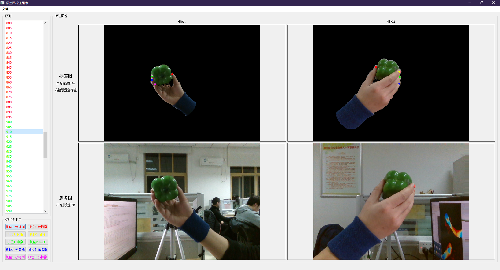

# Description

This is a annotation tool for labeling finger position 
on two cameras (or for two hands), together with two reference 
pictures optionally. The tool is based on python3 and Qt5. 
But you can use pyinstaller to create an exe program for windows
or download it from the release repository directly.



Now this tool only support Chinese Language.

## run or build

Run using python3:
```python
python marker_annotation.py
```

Or to create an exe program (can be download in `release`):
```python
python pyinstall.py  # The generated program will be in dist folder.
```

The `ui_main_window_ui.py` is generated from `ui_main_window.ui` by:
```python
python -m PyQt5.uic.pyuic ui_main_window.ui -o ui_main_window_ui.py
```


## how to use

You need to create a `working_directory` for the image sequences. 
Four of the sequences should be named like this or you need to 
modify it in `sequence_model.py`:

```python
self.img_11_format = 'left_aligned_color_????.png'
self.img_21_format = 'right_aligned_color_????.png'
self.img_12_format = 'left_org_color_????.png'  # optional
self.img_22_format = 'right_org_color_????.png'  # optional
```

The program will load one frame every 5 frames for the four
sequences (you can change it in `sequence_model.py`).

Then load the `working_directory` in the menu. Left mouse click to
label the specified finger in left bottom buttons, and right mouse
click to label it unseen.

Save the label file in the menu or export it to another place.
The default label file `annotation.txt` is in the working_directory.

A recommended rename tool: [Renamer](https://www.den4b.com/products/renamer)
